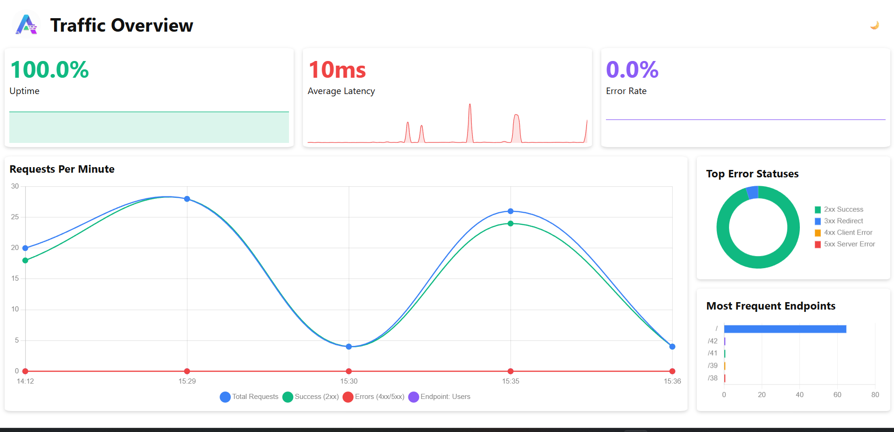

<div align="center">
  <a href="https://www.npmjs.com/package/atriar" target="_blank">
    
  </a>
  <h1>Atriar</h1>
</div>

<p align="center">
  <a href="#project-description">Project Description</a> &nbsp;|&nbsp; 
  <a href="#key-features">Key Features</a> &nbsp;|&nbsp;
  <a href="#tech-stack">Tech Stack</a> &nbsp;|&nbsp; 
  <a href="#installation">Installation</a> &nbsp;|&nbsp;
  <a href="#usage">Usage</a> &nbsp;|&nbsp;
  <a href="#development">Development</a>
</p>

<div align="center">
  <a >
    
  </a>
</div>

---

## Project Description

**Atriar** is a lightweight Express middleware that provides **automatic request logging** with a **static dashboard**.  
It supports **MongoDB** and **PostgreSQL**, provides performance insights, and visualizes traffic using **Chart.js**.

The dashboard is served locally at `server/atriar` and works without cloud accounts. Fully tested with **Jest** and **Supertest**, it’s compatible with **JavaScript** and **TypeScript** projects.

---

## Key Features

- 📝 **Automatic Request Logging** – logs method, path, status, duration, timestamp, IP, user agent, size, and errors
- 📊 **Dashboard** – view logs and performance insights in a static dashboard
- 📈 **Charts** – traffic over time, status distribution with Chart.js
- ⚡ **Performance Insights** – identify slowest and most error-prone endpoints
- 🌐 **Local-First** – no accounts or cloud dependencies required
- 💻 **Multi-DB Support** – MongoDB and PostgreSQL compatible
- 🔹 Works in **JavaScript + TypeScript**

---

## Tech Stack

- **Framework:** Node.js, Express
- **Middleware:** Atriar logging
- **Charts:** Chart.js
- **Testing:** Jest, Supertest
- **Language:** JavaScript / TypeScript

---

## **Installation**

```bash
npm install atriar
# or
yarn add atriar
```

## **Usage**

```typescript
import express from "express";
const atriar = require("atriar").default;

const app = express();

// Add Atriar middleware before your routes (url can be client or mongoatlas link)
app.use(atriar({ provider: "mongodb", url: "mongodb://localhost/atriar" }));

// Example routes
app.get("/api/hello", (req, res) => {
  res.send("Hello World!");
});

app.listen(3000, () => {
  console.log("Server running at http://localhost:3000");
});
```

Once started, open your browser at http://localhost:3000/atriar
to view the dashboard.

## **Development**

```bash
git clone https://github.com/yourusername/atriar.git
cd atriar
npm install
npm run dev
```

## Links

Future updates and releases can be found on npm and GitHub:

- **npm:** [https://www.npmjs.com/package/atriar](https://www.npmjs.com/package/atriar)
- **GitHub:** [https://github.com/nca-gabriel/atriar](https://github.com/nca-gabriel/atriar)
